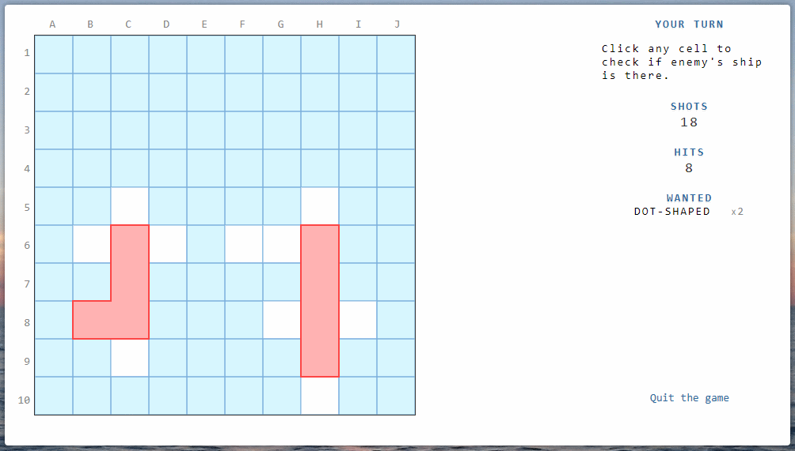

# Battle ship game

Now the project is a complete game of a sea battle which includes the stage of placing the player's ships and fighting against the computer opponent.

## Initial project requirements

Preferably develop following task in React with TypeScript. Make sure code is posted in GitHub or Bitbucket public repo.

1) Let's create an onscreen grid of cells aligned within a square 10 by 10.

2) Then we set up initial battle ships - one L shaped, one I shaped and two dot shaped. Initial battle ships cannot overlap.

3) Start actual game play after any kind of user input which would simulate shots at random positions - any missed shot would indicate already hit area, any shot at any of initial ships would visually indicate that battle ship has sink (change of ship color would be fine enough).

4) Program must be able to tell that all ships have sunk and game is over.
Seems simple enough and will show some actual code and how does person handles UI development - which frameworks and language dialects he feels most comfortable with and stuff like that.

5) Battle ships must not touch one another so there is at least a single cell between them. Any battle ship rotation must be random.
Each ship must have outline color defining boundaries of a ship.

6) Multi cell battle ships (I && L) must consist of 4 cells, so there is no ambiguity of L shapes that do not look like L and I shapes of more or less than 4 cells.

## Implementation

The task is completed in React + Redux on JS ES6. 

The game has been tested in almost all modern browsers including mobile browsers.

## [Demo](https://battleship-453e1.firebaseapp.com/)

UI example:

